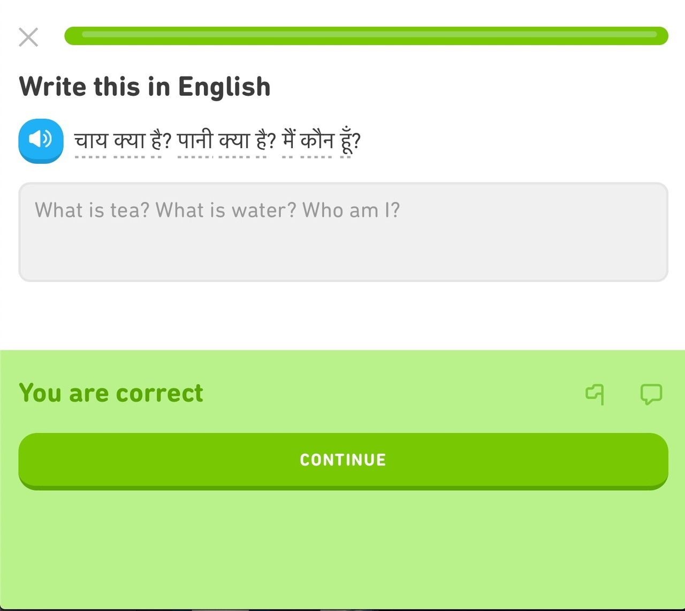

I've not had the best luck with more...traditional methods of learning a new language, so I thought I'd give video games a try. I've actually met a few people who've done this through gaming, either through chatting with other people online, or just playing an RPG from start to finish in another language. So maybe..._just maybe_, this might just work? Read on to see how I've been faring, I guess.

## What I'm playing

I recently finished all the mainline RGG Studio games, so I picked up Yakuza Ishin (龍が如く　維新！) not too long ago to scratch the _"I need more Yakuza games to play"_ itch. The problem is, it's all in Japanese. And though the game's been out for quite some time now, localisation plans haven't really been set in stone. So instead of waiting for it to be released in English, I decided to use this as an opportunity to study Japanese at my own pace, in a more consistent manner.

## Learning languages on your own

A bit about how I've learned Japanese. I did formal Japanese lessons for a bit whilst I was at uni, but I've since been learning the language on my own. Here's what I've tried so far, and how I've fared with these methods:

- **Reading manga, the news, etc. in Japanese**
  - Both pretty great ways to pick up new words and vocab. You don't really get much practice listening though. Also, unfortunately, these methods weren't that engaging, so I couldn't quite build up the momentum to study Japanese daily this way.
- **Trying to read textbooks from cover to cover**
  - Textbooks are pretty great since you can go from point A to point B without having to build a learning plan or strategy on your own. But again, not the most engaging.
- **...Duolingo**
  - Although the app is built to gamify language learning and encourage you to get on the app daily, I found it to be too slow of a pace for me to learn things. Also what's up with those phrases??

Source: [Weird Duolingo Phrases](https://wtfduolingo.tumblr.com/)
Seriously, who writes these things?

It goes without saying that if you want to learn something, you have to be pretty consistent with it. Personally, I've not had the best of luck with the methods listed above, as they never really encouraged me to build the momentum to study and review things daily.

## Video games as an alternative: The journey so far

Anyway, Ishin. And learning. So far, it's coming along great. I play the game every night for a few hours, so I get to do a good chunk of listening and reading practice. There are a bunch of key words and grammar patterns that get repeated quite often, so I also get the benefit of learning through spaced-repetition without having to boot up Anki on my phone - a win in my book. I have a stack of papers with words I've picked up while playing, and I usually refer back to it when I come across the word again. I've had the word 怪我 seared into my brain now at this point, as it comes up so, _so_ often.

## Moving Forward

At this point, I think I've picked up a whole lotta new words. But grammar is where I find that I'm falling short. The next plan of action is to go over N4 and N5 level grammar patterns, and see where it goes from there.
