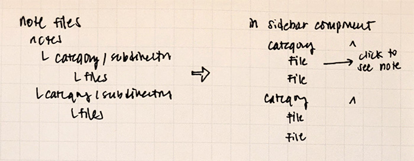

For this project, I wanted the `Sidebar` component to reflect the way my Markdown files were organised, like so (apologies for the chickenscratch handwriting):



```text
notes/
├── baking/
│   ├── apple-pie.mdx
│   ├── pie-crust.mdx
│   └── troubleshooting-bagels.mdx
├── programming/
│   ├── making-new-notes-with-plop.mdx
│   ├── subdirectories-as-categories-in-gatsby.mdx
│   └── syntax-highlighting-tailwind.mdx
└── other-category/
```

It's pretty straightforward, and I wanted my notes to be just as easy to access on the site itself. I translated this over to the `Sidebar` component, with each category being an accordion that you could toggle to view notes under that topic.

## Getting The Sidebar to Work

Since I needed to pull data into a component and not a page, I used `useStaticQuery` in the `Sidebar` component.

So about that static query.

I needed my data to be shaped in such a way that I could iterate through the subdirectories (or categories) in the `notes` directory, and then iterate through the files in each subdirectory. Luckily, Gatsby lets you access your data through GraphQL, which is great, because you get to do things like this:

```graphql
{
  allFile(filter: { sourceInstanceName: { eq: "notes" } }) {
    group(field: relativeDirectory) {
      edges {
        node {
          id
          childrenMdx {
            frontmatter {
              title
            }
            slug
          }
        }
      }
      fieldValue
    }
  }
}
```

Breaking it down:

- Run a query to look through the project's file system (`allFiles`)
- `filter: { sourceInstanceName: { eq: "notes" } }` ensures that we're just looking at files in the `notes` directory.
- `group(field: relativeDirectory)` groups files based on the subdirectory they're in. So files in the `baking` subdirectory get grouped together and so on.
- To get the category names from the subdirectories, I included `fieldValue` in my query.
- The file `node` object has all the fields I've included in my query, namely the note title and slug.

This query's output gets returned as JSON and looks a bit like this:

```json
{
  "data": {
    "allFile": {
      "group": [
        {
          "edges": [
            {
              "node": {
                "id": "f5a150e8-bb20-5457-8a1b-0fa2e7369109",
                "childrenMdx": [
                  {
                    "frontmatter": {
                      "title": "Apple Pie"
                    },
                    "slug": "baking/apple-pie"
                  }
                ]
              }
            },
            {
              // other baking-related notes
            }
          ],
          "fieldValue": "baking"
        },
        {
          "edges": [
            {
              // programming notes
            }
          ],
          "fieldValue": "programming"
        }
      ]
    }
  }
}
```

From here, I can map through the `group` array, and then map through `edges` to get the file nodes.

## Resources

- [Sourcing from the File System](https://www.gatsbyjs.com/docs/how-to/sourcing-data/sourcing-from-the-filesystem/)
